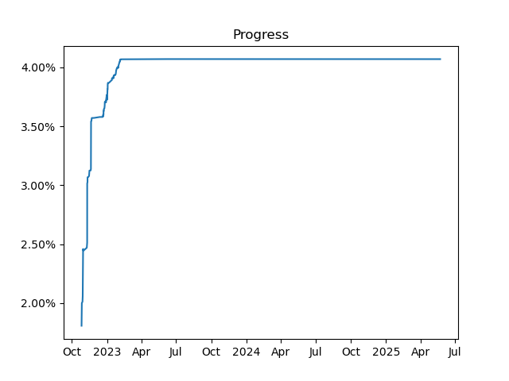

# RedPepper

This is a decompilation of the EU version of Super Mario 3D Land (note that retail JP, KO, TW, and US versions are nearly identical). This is a fork from the repo on 3dsdecomp's github, and recieved some structural updates.

## Progress

 

 

## How To

As noted earlier, this fork made some updates regarding structure of some files.   
   
- code.bin goes to the data/ folder.
- symbol files are gone, instead use the .csv files inside of the data/ folder.
Visit [the Wiki](https://al.littun.co/decomp) for instructions on how to build and contribute to this project.

## Links

- [Discord Server (now dead)](https://discord.gg/wK4ZKa9QXq)
- [Wiki](https://al.littun.co/decomp)
- [decomp.me](https://decomp.me/)

## Credits
- [open-ead/sead](https://github.com/open-ead/sead)
- [original repo on 3dsdecump](https://github.com/3dsdecomp/RedPepper)
